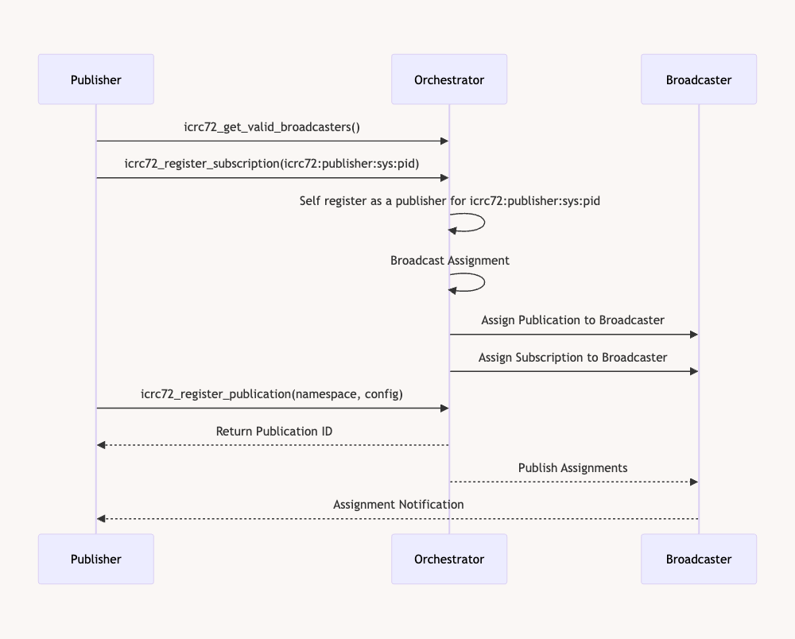

|ICRC|Title|Author|Discussions|Status|Type|Category|Created|
|:----:|:----:|:----:|:----:|:----:|:----:|:----:|:----:|
|72|Minimal Event-Driven Pub-Sub Standard|Austin Fatheree (@skilesare),Ilia Agafonov @ava-vs, Byron Becker @byronbecker, Ethan Celletti @gekctek, Lachlan Witham, Zhenya Usenko, Matthew Harmon|https://github.com/dfinity/ICRC/issues/72|Draft|Standards Track|Protocols|2024-04-10|

# ICRC-72: Minimal Event-Driven Pub-Sub Standard

ICRC-72, the Minimal Event-Driven Pub-Sub Standard, is designed to establish a robust framework for implementing publish-subscribe messaging patterns on the Internet Computer. This standard facilitates the communication and synchronization of data across different canisters, enabling them to subscribe to and publish events effectively. By formalizing the interactions between publishers, subscribers, and broadcasters, ICRC-72 aims to enhance the interoperability, scalability, and efficiency of decentralized applications on the Internet Computer.

The publish-subscribe pattern, a pivotal architectural style, allows components of distributed systems to exchange information asynchronously. This pattern decouples the service provider (publisher) from the service consumers (subscribers), using an event-driven approach that promotes loose coupling and dynamic network topologies. ICRC-72 leverages these benefits to provide a standardized mechanism where canisters can subscribe to specific types of messages and react to them, without needing to poll or maintain a direct linkage to the message originators.

Key components of ICRC-72 include:
- **Publishers** who generate and send messages to broadcasters.
- **Broadcasters** who receive messages from publishers and distribute them to all registered subscribers.
- **Subscribers** who listen for messages of interest from broadcasters and process them accordingly.
- **Orchestrator** who manages network topography, subscriptions, publications, and assignments.

This standard describes how these roles interact within the Internet Computer ecosystem, detailing the methods, data structures, and protocols necessary for establishing effective and secure communication channels. ICRC-72 also offers flexible configurations to support various messaging patterns, such as FIFO (First In, First Out), priority-based message delivery, and resilient message handling in the face of temporary canister outages.

## Data Representations

### Event Identifiers

1. Event identifiers MUST be represented as natural numbers with infinite precision. These MAY be blob representations of more complex numbering schemes, converted to natural numbers. If an identifier is encoded, it MUST be encoded using Crockford's Base32, as specified at [Crockford's Base32](https://www.crockford.com/base32.html).

2. Event identifiers MUST be unique for a specific event namespace.

2. Events MAY specify a `prev_id` to indicate the immediately preceding message identifier known by the broadcasting system. Event systems SHOULD provide `null` in scenarios where event ordering is not critical or where ordering depends on details internal to the identifier. Event systems MAY interpret the `prev_id` based on implementation specifics, such that:

   - In Single Publisher, Single Broadcaster systems, a consistent chain of messages SHOULD be maintained with no messages being dropped.
   
   - In Single Publisher, Multi-Broadcaster systems, a consistent chain of messaging SHOULD be maintained according to nonce partitioning, with no messages being dropped.

   - In Multi Publisher, Multi-Broadcaster systems, consistent chains SHOULD be maintained across publisher-based partitions. Each partition SHOULD either remain consistent or all messages MAY be ordered, provided there is an event-specific epoch close-out schema.

### Timestamps

Timestamps represent the time on the canister that produced the event during the block the event was submitted for publishing. They are represented as Natural numbers and are UTC Nanoseconds.

### Namespaces

Events on the IC SHOULD use a namespacing pattern that ensures the event namespace does not infringe on the scope of other possible messages.  For more information see [this thread](https://forum.dfinity.org/t/proposal-to-adopt-the-namespaced-interfaces-pattern-as-a-best-practice-for-ic-developers/9262). 

For example, do not use a namespace of "transfer" as many other canisters on the IC may have similar "transfer" events and your event may become inoperable with other canisters that already consume the "transfer" event. Users SHOULD choose a namespace that they can demonstrate control over. For example if you own the domain foo.com, a good namespace would be com.foo.{application}.transfer. Future event systems MAY ask you to prove ownership of a domain that you with to create a publication for.

The use of namespaces with wildcards and filters can significantly enhance the usability and effectiveness of subscription systems. This approach offers users the ability to finely adjust event monitoring, providing both precision and adaptability in dynamic information environments. For instance, namespaces can be structured using wildcards such as *.category.* or *.topic.*, allowing for broad or specific event categorization. Filters can then be applied to further refine subscriptions, such as category: [sports, technology] or topic: [finance, marketing], enabling users to tailor their subscriptions to their specific interests and needs.

Appendix - [Discussion about namespacing and wildcards for subscriptions](https://github.com/icdevs/ICEventsWG/issues/33)

### Event Data

Event data is represented using ICRC-16 generic typing variants.  Implementations that wish to use only the `Value` subset of ICRC-16 that is found in ICRC-3 MAY do so as ICRC-16 is a super type of that type.

```candid "Type definitions" +=
// Generic value in accordance with ICRC-3
type ICRC16 =
  variant {
    Array: vec CandyShared;
    Blob: blob;
    Bool: bool;
    Bytes: vec nat8;
    Class: vec ICRC16Property;
    Float: float64;
    Floats: vec float64;
    Int: int;
    Int16: int16;
    Int32: int32;
    Int64: int64;
    Int8: int8;
    Map: vec record ICRC16Map;
    ValueMap: vec ICRC16ValueMap;
    Nat: nat;
    Nat16: nat16;
    Nat32: nat32;
    Nat64: nat64;
    Nat8: nat8;
    Nats: vec nat;
    Option: opt CandyShared;
    Principal: principal;
    Set: vec CandyShared;
    Text: text;
};

type ICRC16Property =
  {
    name : text;
    value: ICRC16;
    immutable: bool;
  };

  type ICRC16Map = record { Text; ICRC16};

  type ICRC16ValueMap = record { ICRC16; ICRC16}
```

Event Broadcast Canisters and Event Relayers MUST NOT manipulate the data field.  Any data annotations should be done in the header collection and must be append only such that no headers are overwritten or changed.

### Event Headers

Events also have an optional header property that, if provided should be an ICRC16Map.  This collection allows for the emitter to provide additional data that is not directly relevant for the item, but that may be important for validation or measurement of the event.  As the event travels from the publisher, through a broadcaster, a relay and ultimately to a subscriber, the network participants may add headers to this collection.

For the purposes of this standard the following headers are established:

`icrc72:eventData:hash` - a #Blob containing the representational independent hash of the event.
`icrc72:broadcaster:received` - a #Nat the timestamp that the broadcaster received the event.
`icrc72:broadcaster:priority` - a #Array of #Nat where the first item is the position in priority and second item is the total subscriber count.
`icrc72:relay:sent` - a #Nat the timestamp that the broadcaster sent the event to a relay.
`icrc72:relay:received` - a #Nat the timestamp that the relay received the event.
`icrc72:broadcaster:sent` - a #Nat the timestamp that the broadcaster sent the event.

### Event Notification Identifiers

1. Event notification identifiers MUST be represented as natural numbers with infinite precision. These numbers MAY be blob representations of more complex numbering schemes, converted to natural numbers. If an identifier is encoded, it MUST be encoded using Crockford's Base32, as specified at [Crockford's Base32](https://www.crockford.com/base32.html).

2. Event Notification Ids will only be consistent and unique in the context of the broadcaster that related the event in the notification.

### Event Notification Source

Event Notifications include a Source that is the principal of the canister that emitted the event.

### Event Notification msg.caller

The `icrc72_handle_notification` and `icrc72_handle_notification_trusted` endpoints provide the broadcaster principal in the msg.caller variable included with the message.

### Filters

Filters SHOULD the notations provided in ICRC16 Path Standard.  Event system implementers MAY designate their own format if the previous is not sufficient.

### Publications Configs

When registering a publication, a publisher MAY provide a configuration as a `vec ICRC16Map` that contains relevant information for the event such as allow lists, disallow lists, ICRC-75 dynamic lists, publications modes, etc.  It is up to the implementation to decide which are necessary and supported.

The following items SHOULD be used for the indicated patterns:

 * `icrc72:publication:publishers:allowed:list`: Array([#Blob(PrincipalAsBlob])
 * `icrc72:publication:publishers:disallowed:list`: Array([#Blob(PrincipalAsBlob])
 * `icrc72:publication:publishers:allowed:icrc75`: Array([#Blob(CanisterIDAsBlob), #Text("namespace")]);
 * `icrc72:publication:publishers:disallowed:icrc75`: Array([#Blob(CanisterIDAsBlob), #Text("namespace")]);
 * `icrc72:publication:subscribers:allowed:list`: Array([#Blob(PrincipalAsBlob])
 * `icrc72:publication:subscribers:disallowed:list`: Array([#Blob(PrincipalAsBlob])
 * `icrc72:publication:subscribers:allowed:icrc75`: Array([#Blob(CanisterIDAsBlob), #Text("namespace")]);
 * `icrc72:publication:subscribers:disallowed:icrc75`: Array([#Blob(CanisterIDAsBlob), #Text("namespace")]);

Appendix: [Move allow and disallow to config. Move modes to config](https://github.com/icdevs/ICEventsWG/issues/18)

### Subscription Configs

When registering a subscription, a publisher MAY provide a configuration as a `vec ICRC16Map` that contains relevant information for the subscription such as skips, filters, creating stopped, etc.  It is up to the implementation to decide which are necessary and supported.

The following items SHOULD be used for the indicated patterns:

 * `icrc72:subscription:skip`: Array[Nat, Nat]; Get every Xth message with an optional offset.
 * `icrc72:subscription:filter`: Text; The ICRC16 Path filter
 * `icrc72:subscription:stopped`: Bool; Do you want the subscription started upon registration;

### Statistics

For statistics please se ICRC-92.

### Event Data Types

#### Event

Events are published from publishers by being sent to broadcasters.

- **id** (`nat`): A unique identifier for the event, allowing for distinct referencing across an event namespace.
- **prevId** (`opt nat`): A unique identifier for the previous event if applicable.
- **timestamp** (`nat`): The Unix epoch timestamp in nanos denoting when the event occurred.
- **namespace** (`text`): A textual descriptor that categorizes the event into a domain-specific context for easier management and filtering.
- **data** (`ICRC16`): The payload of the event, conforming to the ICRC-16 data standard which provides a versatile structure to accommodate various data formats.
- **header** (`opt ICRC16Map`): Data annotation and statistics about the event that may be relevant to intermediate or receiving parties.

```candid
// An event structure being published
let event = {
  id = 123456789;
  prevId = 123456788;
  timestamp= 1672525600000000000;  // Example timestamp in nanoseconds
  namespace = "com.example.myapp.events";
  data: #Map([
    ("com.example.mayapp.event.host", #Text("John Smith")),
    ("com.example.mayapp.event.date", #Nat(1672525600000000000)),
  ]);
  headers: opt #Map(["content-type", value: variant { Text: "ICRC16"}])
};
```

#### EventRelay

When a broadcaster identifies that certain events should be relayed to other subnets it will use an Event  Object to pass the event across a subnet boundary.


#### EventNotification

Subscribers receive event notifications from broadcasters.

- **id** (`nat`): Unique identifier for the event notification.
- **eventId** (`nat`): The identifier of the original event that triggered this notification.
- **eventPrevId** (`opt nat`): A unique identifier for the previous event if applicable.
- **timestamp** (`nat`): Time at which the notification was generated, in Unix epoch format, nanoseconds.
- **namespace** (`text`): The namespace of the event, serving as a categorizational tool to differentiate events.
- **data** (`ICRC16`): Data associated with the event, encoded according to ICRC-16 specifications.
- **header** (`opt ICRC16Map`): Data annotation and statistics about the event that may be relevant to intermediate or receiving parties.
- **source** (`Principal`): The principal ID of the canister that dispatched the event.
- **filter** (`?text`): Optional text filter that was used to filter a positive match for this event.

```candid
// An event structure being published
let eventNotification = {
  id = 987654321;
  eventId = 123456789;
  eventPrevId = 123456788;
  timestamp= 1672525600000000000;  // Example timestamp in nanoseconds
  namespace = "com.example.myapp.events";
  data = #Map([
    ("com.example.mayapp.event.host", #Text("John Smith")),
    ("com.example.mayapp.event.date", #Nat(1672525600000000000)),
  ]);
  headers = ?#Map(["content-type", value: variant { Text: "ICRC16"}]);
  source = Principal.fromText("aaaaa-aa")
};
```


```candid "Type definitions" +=

  type Event{
    id: nat;
    prevId: opt nat;
    timestamp: nat
    namespace: text;
    data: ICRC16;
    source: principal;
    headers: ?ICRC16Map
  };


  type EventNotification{
    id: nat;
    eventId: nat;
    preEventId: opt nat;
    timestamp: nat
    namespace: text;
    data: ICRC16;
    headers: ?ICRC16Map
    source: Principal;
    filter: ?text;
  };
```

Appendix: 
  [Use Principal instead of account. Maybe use derived canisterIds in the future](https://github.com/icdevs/ICEventsWG/issues/17)

 Appendix:
  [Notification should include filter used](https://github.com/icdevs/ICEventsWG/issues/17)


### Publication Data Types

#### PublicationRegistration

Publication Registrations should be sent from a publisher to the Orchestrator canister to indicate the desire to publish a particular event.  

- **namespace** (`Text`): Defines the topic or category of the events that a publisher can publish under.
- **config** (`[ICRC16Map]`): Configuration details specific to the publication, catering to customization and control mechanisms like access lists or publication rules.

```candid
// Register a new event publication with specific configurations
let publicationRegistration = {
  namespace: "com.example.myapp.events";
  config: [
    ("icrc72:publication:publishers:allowed:list", #Array([#Blob(Principal.toBlob()"aaaaa-aa")])),
    ("icrc72:publication:mode", #Text("fifo"))
  ];
  memo: ?Text.toUtf8("Initial registration of MyApp events")
};
```

#### PublicationInfo

Represents a particular publication namespace and any statistics about that publication.

- **namespace** (`text`): Identifier for the category or domain of publication.
- **stats** (`[Map]`): Statistical data relevant to the publication, possibly including metrics like number of subscribers, total events published, etc.

#### PublisherInfo

Represents a particular publisher namespace and any statistics about that publication.

- **publisher** (`principal`): Principal ID of the publisher.
- **stats** (`[Map]`): Contains statistical data concerning the publisher, such as number of publications, event counts, etc.

#### PublisherPublicationInfo

Represents a particular publication namespace, publisher tuple and any statistics about that pair.

- **publisher** (`principal`): The identifier of the publisher.
- **namespace** (`principal`): The namespace associated with specific publications by the publisher.
- **stats** (`[Map]`): Detailed metrics related to publications in the specified namespace by the publisher.

``` candid "Type definitions" += 
type PublicationRegistration {
  namespace: text;
  config: [ICRC16Map];
  memo: blob;
};

type PublicationInfo {
  namespace: text;
  config: [ICRC16Map];
  stats: [Map];
}

type PublicationUpdateRequest = {
    publication : variant{
        id: nat;
        namespace: text;
    };
    config : opt [ICRC16Map];
    memo: blob;
};

type PublisherInfo {
  publisher: principal;
  stats: [Map];
};

//broken down by namespace
type PublisherPublicationInfo {
  publisher: principal;
  namespace: principal;
  config: [ICRC16Map];
  stats: [Map];
};
```

Appendix: [Allowed Publishers and subscribers should use the config](https://github.com/icdevs/ICEventsWG/issues/18)

Appendix: [Memo and created at time discussion](https://github.com/icdevs/ICEventsWG/issues/35)


### Subscription Data Types

#### Subscription Registration Namespaces

Implementations MAY support wildcards for subscriptions.  For example, a subscription to `*.icrc1.transfer` might register a subscriber to any events that produce a standard icrc1.transfer event regardless of the canister that emitted it.  The subscription canister must take technical limitations into account when making these subscriptions as the canister may overload itself. The wild-card language that is used is purposely left out of this standard and must be defined by the implementation of the events system.

#### Filtering records

A subscriber MAY provide a filter in textual representation to filter out certain records for the subscription in the config. Implementations SHOULD continue to develop CandyPath that can filter through ICRC-16 values, but the implementation MAY use a text query language of their own choosing.

#### Skipping records

A subscriber MAY provide a skip config to ask the canister to skip broadcasting for either bandwidth or distribution reasons.   The skip parameter is a tuple of the mod and optional offset `Array[Nat, opt nat]`.  If the mod is set then the subscriber should only receive a message if the mod of the value provided is 0.  This can be offset for partitioning by using the optional partition variable.  By using this pattern a subscriber set can ensure that all messages make it to a set of subscribers with a distributed message set. 

- **nat** (`nat`): The modulus value for determining which messages to skip. For example, a value of 5 means every 5th message is considered.
- **opt nat** (`?nat`): An optional offset that adjusts which messages are skipped, further refining the control over message selection in large streams.

#### SubscriptionRegistration

Sent by a subscriber to an Orchestrator canister to register the desire to start listening to a publication.

- **namespace** (`Text`): Defines the topic or category that the subscriber is interested in.
- **config** (`[ICRC16Map]`): Configuration for the subscription, including elements like message filters or skip patterns.
- **memo** (`opt Blob`): A 32 Byte memo. Optional.

```candid
// Register a new event publication with specific configurations
let subscriptionRegistration = {
  namespace: "com.example.myapp.events";
  config: [
    ("icrc72:subscription:skip", #Array([#Nat(5),#Nat(1)])),
    ("icrc72:subscription:filter", #Text("host[name ~= John]"))
  ];
  memo: ?Text.toUtf8("Initial subscription of MyApp events")
};
```

#### SubscriptionInfo

Sent by a subscriber to an Orchestrator canister to register the desire to start listening to a publication.

- **subscriptionId** (`Nat`): The ID of a registered Subscription.
- **namespace** (`Text`): Defines the topic or category that the subscriber is interested in.
- **config** (`[ICRC16Map]`): Configuration for the subscription, including elements like message filters or skip patterns.
- **stats** (`[Map]`): Statistical information regarding the subscriber's activity, such as number of messages received, active subscriptions, etc.


#### SubscriberInfo

Represents data about a particular subscriber and their statistics.

- **subscriber** (`Principal`): The principal ID of the subscriber.
- **stats** (`[Map]`): Statistical information regarding the subscriber's activity, such as number of messages received, active subscriptions, etc.

#### SubscriberSubscriptionInfo

Represents data about a subscription and its statistics.

- **subscriber** (`principal`): The principal ID of the entity subscribed to the events.
- **namespace** (`text`): The namespace pertaining to the subscribed events.
- **config** (`vec ICRC16Map`): Configuration settings specific to the subscriber, which may include filters and skip details.
- **filter** (`?Text`): A potential textual filter that further refines what events the subscriber receives based on content or type.
- **skip** (`?Skip`): Defines if and how certain events are skipped during the subscription period, optimizing the flow of information.
- **stats** (`vec ICRC16Map`): Vector of key-value pairs capturing statistical data about the subscription.

#### SubscriptionUpdate

- **subscription** (`variant{id: nat; namespace: text;};`): Identifier of the subscription to be updated.
- **newConfig** (`opt vec {text, ICRC16}`): Optional new configuration settings to replace or update the existing subscription configurations.


``` candid "Type definitions" +=
type Skip = record {nat; opt nat};

type SubscriptionRegistration {
  namespace: text;
  memo: blob
};
```

``` candid "Type definitions" +=
type SubscriberSubscriptionInfo {
  subscriptionId : nat;
  subscriber: principal;
  config: vec ICRC16Map;
  stats: vec ICRC16Map;
};


type SubscriptionInfo {
  subscriptionId: Nat;
  namespace: text;
  config: vec ICRC16Map;
  filter: ?Text; 
  skip: ?Skip;
  stats: vec ICRC16Map;
};

type SubscriberInfo {
  subscriber: Nat;
  stats: vec ICRC16Map;
};

type SubscriptionUpdate = {
    subscription : variant {
        id: nat;
        namespace: text;
    };;
    newConfig : opt vec {text, ICRC16};
    memo: blob;
};
```

## Ingress methods

Generally pub/sub should be ONLY intercanister methods. If you want to publish an event message, have a call to another method and emit the event.

## Methods

### Orchestrator Canister

#### Orchestrator Update Methods

1. **icrc72_register_publication**: This method registers one or more new publications based on provided details in `PublicationRegistration` structures. It returns a list of results, each indicating successful registration with a unique identifier or an error if the registration failed.

2. **icrc72_register_subscription**: Analogous to publication registration, this method registers one or more new subscriptions as described in the `SubscriptionRegistration` structures. Each subscription registration attempts are returned in the resulting list, indicating either successful registration with an identifier or an error.

3. **icrc72_update_publication**: This method takes a vector of `PublicationUpdateRequest` records and returns a vector of optional `UpdatePublicationResult`. It is used to apply changes to registered publications such as updating configuration or namespace details. Each element in the input corresponds to a publication update action, and the method provides corresponding results for each action in the output.
   
4. **icrc72_update_subscription**: Similar to publication updates, this method accepts a vector of `SubscriptionUpdate` records for updating existing subscriptions. The outputs are encapsulated in a vector of optional `UpdateSubscriptionResult`, detailing the success or error of each subscription update action. This allows subscribers to modify aspects of their subscriptions like filters, skips, or activation status.

//todo: what errors will we run into?

```candid "Types" +=

type GenericError = {
  error_code: Nat;
  message: Text;
}

type PublicationRegisterError = variant {
  Unauthorized; //generally unauthorized
  UnauthorizedPublisher : {
    namespace: Namespace; //The publisher is not allowed, Look up config by message: Text;
  };
  ImproperConfig: Text; //maybe implementation specific
  GenericError: GenericError;
};

type SubscriptionRegisterError = variant {
  Unauthorized; //generally unauthorized
  UnauthorizedSubscriber: {
    namespace: Namespace; //The publisher is not allowed, Look up config by message: Text;
  };
  ImproperConfig: Text;  //maybe implementation specific
  GenericError: GenericError;
};

type PublicationRegisterResult = variant {
  Ok: nat;
  Err: PublicationRegisterError;
};


type SubscriptionRegisterResult = variant {
  Ok: nat;
  Err: SubscriptionRegisterError;
};


type UpdatePublicationResult = variant {
  Ok: bool;
  Err: PublicationRegisterError;
};


type SubscriptionUpdateResult = variant {
  Ok: bool;
  Err: SubscriptionRegisterError;
};

```

```candid "Methods" +=
// Register new publications with configurations provided by the caller.
// Returns a vector of results, which may contain either an ID of the registered publication or an error.
icrc72_register_publication : (vec PublicationRegistration) -> (vec PublicationRegisterResult);

// Register new subscriptions with configurations provided by the caller.
// Returns a vector of results, which may contain either an ID of the registered subscription or an error.
icrc72_register_subscription : (vec SubscriptionRegistration) -> (vec SubscriptionRegisterResult);

// Update existing publications based on provided configurations.
// Returns a vector of results, indicating success or providing an error detail for each publication update.
icrc72_update_publication : (vec PublicationUpdate) -> (vec UpdatePublicationResult);

// Update existing subscriptions based on provided configurations.
// Returns a vector of results, indicating success or providing an error detail for each subscription update.
icrc72_update_subscription : (vec SubscriptionUpdate) -> (vec UpdateSubscriptionResult);
```


### Orchestrator Query Methods

These methods facilitate the orchestration and supervision of the publish/subscribe system’s state without altering any data.

#### icrc72_get_publishers

Retrieves a paginated list of publishers known to the Orchestrator canister. Filtering based on provided statistical filters is possible.

- **Parameters**:
  - `prev`: Optional. The principal of the last publisher in the previous query to establish pagination context.
  - `take`: Optional. Maximum number of publisher entries to return.
  - `statsFilter`: Optional. Filters for fetching specific statistical data.

- **Returns**:
  - A list of `PublisherInfo` which contains structured information about each known publisher including statistical data.

#### icrc72_get_publications

Fetches information about registered publications in a paginated format, optionally filtered by statistical metrics.

- **Parameters**:
  - `prev`: Optional. The namespace of the last publication fetched which helps in pagination.
  - `take`: Optional. The number of publication entries to return.
  - `statsFilter`: Optional. Filters applied to statistical data retrieval for each publication.

- **Returns**:
  - A list of `PublicationInfo` detailing each publication’s namespace and associated statistics.

#### icrc72_get_publication_publishers

Provides a paginated list of publishers associated with a specific publication namespace. Includes statistical data based on filters.

- **Parameters**:
  - `namespace`: Specifies the publication namespace for which publisher data is requested.
  - `prev`: Optional. Principal of the last publisher in the previous set for pagination.
  - `take`: Optional. Number of entries to return.
  - `statsFilter`: Optional. Filters to specify which statistical data to return.

- **Returns**:
  - A list of `PublisherPublicationInfo` containing details about publishers for the specified publication namespace and their statistics.

#### icrc72_get_subscribers

Retrieves a list of all subscribers known to the Orchestrator canister, support pagination and statistical filtering.

- **Parameters**:
  - `prev`: Optional. The principal of the last subscriber in the last fetched list for pagination.
  - `take`: Optional. The maximum number of subscriber entries to return.
  - `statsFilter`: Optional. Statistical filters to narrow down the data retrieval.

- **Returns**:
  - A list of `SubscriberInfo` providing detailed information on each subscriber including their activity statistics.

#### icrc72_get_subscriptions

Fetches details about subscriptions to a specific publication namespace, including optional statistical filtering.

- **Parameters**:
  - `namespace`: The namespace of the publication for which subscription information is requested.
  - `prev`: Optional. Principal of the last subscriber in previous fetch to continue pagination.
  - `take`: Optional. Number of subscription entries to return.
  - `statsFilter`: Optional. Filters for retrieving specific statistical data.

- **Returns**:
  - A list of `SubscriptionInfo` offering detailed data on subscriptions to the specified namespace and their statistics.

#### icrc72_get_broadcasters

Returns a list of all broadcasters known to the system, supports pagination and statistical filters.

- **Parameters**:
  - `prev`: Optional. The principal of the last broadcaster from the previous query result for pagination continuation.
  - `take`: Optional. The maximum number of broadcaster entries to be returned.
  - `statsFilter`: Optional. Statistical filters to specify which data to fetch about broadcasters.

- **Returns**:
  - A list of `BroadcasterInfo` which provides structured information about each broadcaster including associated statistics.

#### icrc72_get_publication_broadcasters

Fetches broadcaster information associated with a specific publication namespace in a paginated list.

- **Parameters**:
  - `namespace`: Publication namespace for which broadcaster information is desired.
  - `prev`: Optional. The principal of the last broadcaster in the previous query for pagination.
  - `take`: Optional. The maximum number of broadcaster entries to return.
  - `statsFilter`: Optional. Statistical filters to narrow down broadcaster information.

- **Returns**:
  - A list of `BroadcasterInfo` detailing broadcasters associated with the specified publication and their statistics.

#### icrc72_get_broadcaster_subscriptions

Provides subscription data associated with a specific broadcaster, supports pagination and the use of statistical filters.

- **Parameters**:
  - `prev`: Optional. The principal of the last subscriber in the previous list for continued pagination.
  - `take`: Optional. The number of subscription entries to return.
  - `statsFilter`: Optional. Filters for retrieving specific statistical information.

- **Returns**:
  - A list of `SubscriptionInfo` detailing subscriptions managed by the specified broadcaster and their statistics.

```candid "Methods" +=

// Returns the publishers known to the Orchestrator canister
icrc72_get_publishers({
  prev: opt principal;
  take: opt nat;
  statsFilter: ??(vec map);
}) -> query vec PublisherInfo;

//get publications known to the Orchestrator canister
icrc72_get_publications({
  prev: opt text;
  take: opt nat;
  statsFilter: ??(vec map);
}) -> query vec PublicationInfo;

//get publications known to the Orchestrator canister
icrc72_get_publication_publishers({
  namespace: text;
  prev: opt principal;
  take: opt nat;
  statsFilter: ??(vec map);
}) -> query vec PublisherPublicationInfo;

// Returns the subscribers known to the Orchestrator canister
icrc72_get_subscribers({
  prev: opt principal;
  take: opt nat;
  statsFilter: ??(vec map);
}) -> query vec SubscriberInfo;

icrc72_get_subscriptions({
  prev: opt nat;
  take: opt nat;
  statsFilter: ??(vec map);
}) -> query vec SubscriptionInfo;

icrc72_get_subscription(vec nat) -> query vec ?SubscriptionInfo;

icrc72_get_broadcasters({
  prev: opt principal;
  take: opt nat;
  statsFilter: ??(vec map);
}) -> query vec BroadcasterInfo;

icrc72_get_publication_broadcasters({
  namespace: text;
  prev: opt principal;
  take: opt nat;
  statsFilter: ??(vec map);
}) -> query vec BroadcasterInfo;

icrc72_get_broadcaster_subscriptions({
  prev: opt principal;
  take: opt nat;
  statsFilter: ??(vec map);
}) -> query vec SubscriptionInfo;
```

Missing: get_subscriber_subscriptions, icrc72_get_subscription

## Broadcaster Canister

### Broadcaster Update Functions

These functions define the capabilities of a broadcaster canister in the pub-sub system, focusing on the handling and broadcasting of messages to subscribers.

#### icrc72_publish

- **Type**: Update method
- **Parameters**: A vector of `Event` records.
- **Returns**: A vector of option types either indicating the successful processing with a vector of `nat` representing message identifiers, or an error as `PublishError`.
- **Summary**: Accepts a list of events from publishers and attempts to process and distribute these events to relevant subscribers. It responds with either a list of event identifiers that have been successfully broadcasted or errors encountered during the process. Note: Relays will use this endpoint and implementations will need to inspect the source to see if it matches the caller...if not, then it should be assumed the item is a relay and care should be taken to validate the sender.

#### icrc72_confirm_messages

- **Type**: Update method
- **Parameters**: A vector of `nat` representing notifications identifiers.
- **Returns**: A variant indicating `allAccepted` if all messages are successfully confirmed, or `itemized` with a vector of options detailing individual confirmation results.
- **Summary**: Used by subscribers to confirm the receipt and processing of messages. It helps in managing message flow and tracking subscriber engagement and reliability. Errors specific to each message confirmation are addressed individually.


```candid "Methods" +=

type PublishError = variant {
  Unauthorized;
  ImproperId: Text;
  Busy; // This Broadcaster is busy at the moment and cannot process requests
  GenericError: GenericError;
};

icrc72_publish(vec Event) : vec opt variant{
  #Ok: vec Nat;
  #Err: PublishError;
};


icrc72_confirm_messages(vec nat) -> variant{
  allAccepted;
  itemized: vec opt variant {
    #Ok; //discussion point: cycles charged?
    #Err: ConfirmationError;
  };
};

```

Appendix: [Decision to return simple confirmation message](https://github.com/icdevs/ICEventsWG/issues/29)

## Broadcaster Query Functions

#### icrc72_get_broadcaster_stats

- **Type**: Query method
- **Returns**: `(BroadcasterStats)`
- **Summary**: Returns a comprehensive set of statistics related to the broadcaster’s performance and usage. This includes metrics such as total events handled, events per time unit, error rates, and system resource usage. Useful for monitoring and optimizing broadcaster performance.

```candid "Methods" +=

// Provides comprehensive statistics of the broadcaster.
icrc72_get_broadcaster_stats : () -> (BroadcasterStats) query;
```

//should there be more?


## Subscriber Canister

### Subscriber Update Functions


#### icrc72_handle_notification

- **Type**: Update method
- **Parameter**: `message` (type `EventNotification`)
- **Returns**: `()`
- **Description**: Accepts an `EventNotification` which encapsulates an event that a subscriber is registered to handle. The function processes the notification in the manner defined by the subscriber canister's logic. This one-shot handling is designed for straightforward notification processes without the need for trust-establishment or additional confirmation from the broadcaster.

#### icrc72_handle_notification_trusted

- **Type**: Update method
- **Parameter**: `message` (type `EventNotification`)
- **Returns**: A variant indicating success with an optional value or the error description.
- **Description**: Similar to `icrc72_handle_notification`, but designed for more sensitive or critical operations where additional trust assurances from the broadcaster are required. The trusted notification handler can process different types of inputs and provide detailed execution feedback. This function is crucial for interactions where the integrity and authenticity of the message are paramount.
  
```candid "Methods" +=

icrc72_handle_notification(vec message) : -> () //oneshot

icrc72_handle_notification_trusted(vec message) : -> variant{
  //discussion point https://github.com/icdevs/ICEventsWG/issues/2#issuecomment-2054079257
  #Ok: Value
  #err: Text;
};
```

Appendix: (Add a trusted endpoint for smaller implementations)[https://github.com/icdevs/ICEventsWG/issues/14]

## Subscriber Query Methods

#### icrc72_get_subscriber_stats

- **Type**: Query method
- **Returns**: `(SubscriberStats)`
- **Summary**: Returns a comprehensive set of statistics related to the subscriber's performance and usage. This includes metrics such as total events handled, events per time unit, error rates, and system resource usage. Useful for monitoring and optimizing broadcaster performance.

```candid "Methods" +=

// Provides comprehensive statistics of the subscriber.
icrc72_get_subscriber_stats : () -> (SubscriberStats) query;
```

### Generally-Applicable Specification

Please see the ICRC-7 specifications for the Generally-Applicable Specifications as those items apply here as well:

- Batch Update Methods
- Batch Query Methods
- Error Handling

## Publisher Life Cycle

A publisher that would like to publish events must register it's publication with the Orchestrator canister.  The Orchestrator canister is responsible for emitting an ICRC-72 event that provides the publisher with its assigned broadcaster canister(s).

This makes each publisher also as subscriber.

Work flow:

1. Publisher registers as a subscriber to the namespace `icrc72:publisher:sys:{principal as Text}` by calling the icrc72_register_subscription method.
2. Publisher registers as a publisher for the events it will publish with by calling `icrc72_register_publication` and receives back a publicationId from the Orchestrator canister
3. Publisher will receive broadcaster assignments via a notification that has a data structure as follows:

  - `publicationId`: Nat - ID for the notification
  - `broadcasterAdd`: Array[Blob] - optional - principals being added
  - `broadcasterRemove`: Array[Blob] - optional - principals being removed

 
 4. The publisher will now be ready to broadcast.

 [Flow](https://mermaid.live/edit#pako:eNp9kkFv4jAQhf-KNadWShFOCiQ-VCr00kN3q-W2ilRNnQlYInZqO9KyiP9em0AKKru5OMq8-eaN83YgTUUgwNFHR1rSk8KVxabULDwtWq-kalF79tq9M3Tx2Ci3Jvtd8dPKdZTEk5y36M0V1XwRNXNrsJLofAT1okC-e3iIzYIpaeUsfbO0UlHy5rp3J61qvTL6pi-K9uREuK0Trapue04kDKAlbWp2wsTByIY-VhvL_gXrWVeIg3P26Jxa6Ya0v5DNF-JY6i9LYnTNvLlc-nrH8mzRby3nnv53W-3X2BuNDbkWJSVMGl2r1fktBULgCPaLfGcv7T4_Xeqix-O_P1vc9aL5YkB91dgP41V95EECDdkGVRWytotdJfg1NVSCCK8V1dhtfAml3gcpdt4st1qCqHHjKIGurdCfsjl8pUqFiL30AT7kOIGQMRA7-AMiHU9G0xkv8rzIeDHLEtiCuEtTPuJTnuV5lo7vec73Cfw1JkD5KM0n42nBeTZLJ8UkPcB-H2qHgftPcrkNog)

 

 ```
sequenceDiagram
    participant Pub as Publisher
    participant Orch as Orchestrator
    participant BC as Broadcaster

    Pub->>Orch: icrc72_register_subscription(icrc72:publisher:sys:pid)
    Orch->>Orch: Self register as a publisher for icrc72:publisher:sys:pid
    
    Orch->>Orch: Broadcast Assignment
    Orch->>BC: Assign Publication to Broadcaster
    Orch->>BC: Assign Subscription to Broadcaster

    
    Pub->>Orch: icrc72_register_publication(namespace, config)
    Orch-->>Pub: Return Publication ID
    Orch-->>BC: Publish Assignments
    BC-->>Pub: Assignment Notification
```

 ## Broadcaster Life Cycle

A broadcaster will listen for events from the Orchestrator canister to make sure it has valid event routing information.  The Orchestrator canister is responsible for emitting an ICRC-72 event that provides the broad with its assigned subscriptions and publications.

This makes each broadcaster also as subscriber.

Work flow:

1. Broadcaster registers as a subscriber to the namespace `icrc72:broadcaster:sys:{principal as Text}` by calling the icrc72_register_subscription method.
2. Broadcaster will receive broadcaster assignments via a notification that has a data structure as follows:

  - `publicationIdsAdd`: Array[Nat] - optional - publications the broadcaster can expect events for.
  - `publicationIdsRemove`: Array[Nat] - optional - publications the broadcaster is no longer responsible for.
  - `subscriptionAdd`: Array[Nat] - optional - subscriptions being added
  - `subscriptionRemove`: Array[Nat] - optional - subscriptions being removed
  - `relayAdd`: Array[Array[Nat, Blob]] - optional - subscriptions being added as a relay and the target relay canister
  - `relayRemove`: Array[Nat, Array[Blob]] - optional - subscriptions being removed as a relay and the target relay canister

3. Once the broadcaster receives an event, it needs to pull the needed data from the Orchestrator canister that it needs to fulfill its job. This includes pulling publication info and subscription info.
 
 4. The broadcaster will now be ready to relay notifications.

[Flow](https://mermaid.live/edit#pako:eNqFklFrwjAQx79KuOcqpl21zYOwdnuUDWQgoy9nE2vAJi5Jx5z43Ze2Ticqy0Mv9P_7312420OpuQAGVnw0QpXiSWJlsC4U8WeLxslSblE58mLKNUHbRWGdQafNNZXlLZMZjbxE68QN5LVZtowPG2nXt4h5T_hgSyOXd5DFJbPoof7bNjmYTrOckUdrZaXO5Qgq_sdGnL5u18NH96-Nk-dPoZzt9Sz3ss_BztZev5QXd3QvDY75c61W0tRkJqzFSqrqRCz-QXwRD7QPZeRty9GJvgSZO2z7hABqYWqU3E9333oKcGtRiwKYv3KxwmbjCijUwaPYOD3fqRLYCjdWBNB0KY_bcPoruPRjn_Ur021OAH4ewPbwBSwcxcPxhKZJkkY0nUQB7IANwpAO6ZhGSRKFowea0EMA31r7pHQYJvFonFIaTcI4jcMu2XundQUPP-zX2M8)

  

 ```
 sequenceDiagram
    participant Orch as Orchestrator
    participant BC as Broadcaster
    participant Pub as Publisher
    participant Sub as Subscriber
    participant SubX as SubscriberX
    
    Orch->>BC: Assign Publisher and Subscriber to Broadcaster
    Pub->>BC: Published Events
    BC->>Sub: Broadcast Event
    BC->>SubX: Broadcast Event
    Sub-->>BC: Confirm Messaging
    SubX-->>BC: Confirm Messaging
    BC-->>Orch: Update Event Stats
```

 ## Subscriber Life Cycle

A subscriber that would like to subscribe to events must register it's subscription with the Orchestrator canister.  The Orchestrator canister is responsible for emitting an ICRC-72 event that provides the publisher with its assigned broadcaster canister(s).

Workflow:

1. Subscriber registers as a subscriber to the namespace `icrc72:subscriber:sys:{principal as Text}` by calling the icrc72_register_subscription method.
2. Publisher registers as a subscriber for the events it will publish with by calling `icrc72_register_subscription` and receives back a subscriptionId from the Orchestrator canister.
3. Publisher will receive a subscription activated message via a notification that has a data structure as follows:

  - `subscriptionId`: Array[Nat] - ID of the subscriptions activated
 
 4. The subscriber will now start receiving events.


[Flow](https://mermaid.live/edit#pako:eNptkV9PgzAUxb8KuU-asGUFGX8elgjzwQc10TdDsnTlwpqMFttinMu-uy2MaTJ5oKQ993dOOUdgskLIQONHj4LhmtNG0bYUnn06qgxnvKPCeG_91qPaLZopvkV1LXlRbOc0bkVtFDXyH1VeOE2uJK0Y1WYCjW-Ln61WDpB5nCkWBxuFDXeyjR6tO8OluBG0Rd1Rhr7HpKh5czsC3OjMIiwo817R9EpMmYdB73H9RzhZ3WvNG3Ed6izKC8caY1z9gby4-D18or3gszS85ow6O_17rTOncGlVO5xaKEObqxTgQ4t2l1e2i6MbKsHssMUSMvtZYU37vSmhFCcrpb2RbwfBIKvpXqMPfVdRM3V32cWK2waexoKHnn2wFUB2hC_IgkU0X8YkTZI0JGkc-nCAbBYEZE6WJEySMFjckYScfPiW0kLJPEiixTIlJIyDKI2CAfY-nA2Gpx_Mnb-p)

 

 ```
 sequenceDiagram
    participant Sub as Subscriber
    participant Orch as Orchestrator
    participant BC as Broadcaster
    
    Sub->>Orch: icrc72_register_subscription(namespace, config)
    Orch-->>Sub: Return Subscription ID
    Orch->>Orch: Assign Broadcaster
    Orch->>BC: Register Subscriber
    BC-->>Sub: Event Notifications
    Sub-->>BC: Confirmation Receipt
```


## Extensions

The ICRC-72 standard may be extended or replaced by other ICRC Standards in the future.

### ICRC-77 Event Replay

Notification Replay for recovery of missed messages was specifically removed from this ICRC standard to reduce the size and will submitted under ICRC-77 in the future.

### ICRC-83 Block Schema

Transaction Logs are not required for ICRC-72 implementation, but maybe added for transparency.  The proposed block schemas are handled in an extension to ICRC-72 in ICRC-83.

### ICRC-92 Statistics Definition and Collection for Event Utility

ICRC-72 provides no official set of statistics but recommendations for namespaces and default statistics are suggested in ICRC-92.

## Transaction Deduplication

Due to the inter-canister nature of the platform, transaction deduplication is not necessary.  The underlying framework of the IC should keep messages from being replayed.

Appendix: [Transaction Dedup Vote](https://github.com/icdevs/ICEventsWG/issues/34)

## Security Considerations

This section highlights some selected areas crucial for security regarding the implementation of ledgers following this standard and Web applications using ledgers following this standard. Note that this is not exhaustive by any means, but rather points out a few selected important areas.

### Protection Against Denial of Service Attacks

See notes on ICRC-7

### Protection Against Web Application Attacks

See notes on ICRC-7

## Data Security Considerations

When implementing the ICRC-72 standard for event-driven pub-sub systems on the Internet Computer (IC), it is crucial to consider the security of data both in transit and at rest. Despite the robust architecture of the IC, there are specific considerations that developers must keep in mind to enhance the privacy and security of the system.

### Transparency of Data on the Internet Computer

The IC does not inherently obfuscate or encrypt data stored within canisters or transmitted between them. This means that data stored in canisters and the data sent from one canister to another is not encrypted by default and could potentially be accessed by node providers. Node providers have physical control over the machines that run the various canisters, and while they are expected to follow strict guidelines and protocols to maintain the security and isolation of canister execution, the theoretical risk of data exposure exists.

### Encryption Requirements for Private Data

For data that needs to remain confidential:

- **External Encryption:** To guarantee the privacy of data, it should be encrypted before it is uploaded to the IC. This encryption should be performed externally using secure and robust encryption standards. By doing so, the data remains encrypted while it is at rest on the IC and during transmission between canisters, ensuring that it is only readable by entities possessing the appropriate decryption keys.
  
- **Handling Sensitive Information:** Any sensitive information that must be kept confidential should not rely solely on the infrastructure's security practices but should be explicitly protected through end-to-end encryption techniques.

### Utilizing vetKeys for Enhanced Privacy

While the IC ecosystem is exploring technologies like `vetKeys` to enhance the privacy and security of inter-canister communications, there are limitations to the privacy guarantees they can provide:

- **Intermediate Access:** Canisters involved in encrypting or decrypting the data may still expose decrypted data at those points. If a broadcasting node (either a publisher or a subscriber canister) is responsible for encryption or decryption, the operators of these nodes could theoretically access the unencrypted data.
  
- **Security of Encryption/Decryption Nodes:** Trust in the node handling encryption and decryption is paramount. Careful consideration must be given to the security of these nodes to prevent unauthorized access to sensitive decrypted data. 

## Error Handling

ICRC-72 integrates an inherently asynchronous event-driven system, where publishers dispatch events without requiring direct interaction or feedback from the subscribing systems. This design philosophy emphasizes loose coupling between publishers and subscribers, enhancing system scalability and resilience.

Given the asynchronous communication model, a publisher's responsibility ends when it successfully sends an event to a broadcaster or directly to subscribers. The publisher remains agnostic to how an event is processed by subscribers, which aligns with the principles of isolation and independence in distributed systems. This approach ensures that the publishing canister does not depend on the subscriber’s processing capabilities or state, thereby avoiding tight coupling and complex dependency chains.

### Lack of Synchronous Error Handling

In accordance with the asynchronous communication model:
- **Publishers do not receive feedback** concerning the reception or handling of events by subscribers. Once an event is dispatched correctly from the publisher to the broadcaster (or directly to the subscribers, if applicable), the publisher's responsibility concludes.
- **Error propagation is not actively managed** between publishers and subscribers. Errors that occur in processing an event on the subscriber's end do not retroactively influence the publisher or the broadcaster. Each component handles its own internal errors independently.
- **Broadcasters**, similar to publishers, do not track or manage errors related to a subscriber's ability to process an event. They ensure the events are forwarded as specified but do not confirm processing outcomes.